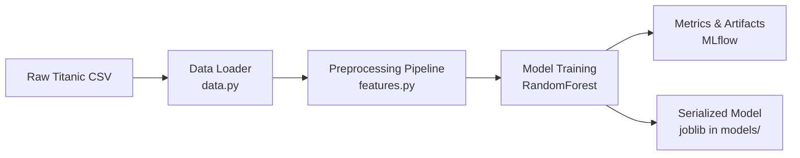
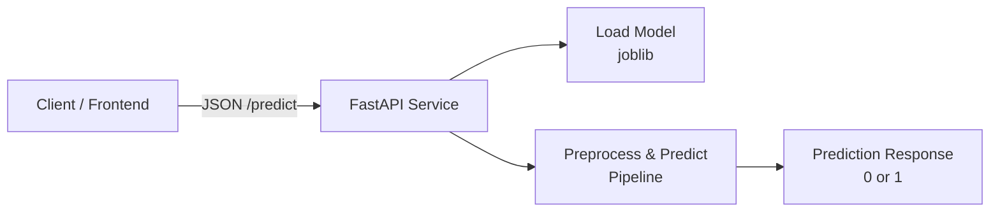
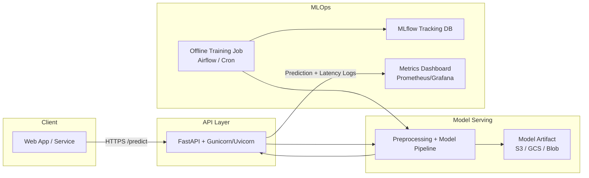

# Project 1 – Tabular ML with MLOps flavor

Goal: Build an end to end tabular ML pipeline on the **Titanic dataset** to predict passenger survival, using patterns that can be reused for other business problems such as credit risk scoring or housing price prediction.

This project covers:

- Data loading and exploratory data analysis (EDA)
- Feature engineering with scikit learn pipelines
- Model training and evaluation (binary classification)
- Experiment tracking with MLflow
- Serving the trained model via a FastAPI endpoint
- Basic tests for data and inference

## Dataset

- Source: Titanic `train.csv` (classic Kaggle dataset), stored at `data/train.csv`.
- Target: `Survived` (0 = did not survive, 1 = survived).
- Example feature columns:
  - Numeric: `Pclass`, `Age`, `SibSp`, `Parch`, `Fare`
  - Categorical: `Sex`, `Embarked`
- Additional columns like `Name`, `Ticket`, `Cabin` are currently unused but could be engineered into features later.

## Architecture

High level flow:

1. `data.py` loads raw data from `data/train.csv` and performs a train/test split.
2. `features.py` builds a `ColumnTransformer` for numeric and categorical preprocessing
   (imputation, scaling, one hot encoding).
3. `model.py` creates a scikit learn `Pipeline` that joins preprocessing with the
   estimator (e.g., `RandomForestClassifier`) and provides evaluation helpers.
4. `train.py` runs training, logs metrics and artifacts to MLflow, and persists the
   trained pipeline as `models/tabular_model.joblib`.
5. `api.py` loads the persisted pipeline on startup and exposes a `/health` and `/predict`
   endpoint via FastAPI. The `/predict` endpoint accepts a JSON payload of Titanic-style
   features and returns a survival prediction.

The goal is not to maximize Titanic leaderboard score, but to demonstrate a clean,
reusable pattern for tabular ML + MLOps that can be applied to other datasets and
business problems.

## How to run

From the repo root, activate your virtualenv, then:

```bash
cd 01_tabular-ml-mlops

# train and log to MLflow
python -m src.train

# start API
uvicorn src.api:app --reload

# after you send a request
curl -X POST "http://127.0.0.1:8000/predict" \
  -H "Content-Type: application/json" \
  -d '{"features": {"feature_1": 0.1, "feature_2": 3.14}}'
```

### Architect “checklist” for this project

As a solution architect, when you glance at this project, you want to be able to say:

1.. Data → Model → API is wired cleanly

- Data loader (data.py) uses a clear config path.
- Feature engineering is modular and testable (features.py).
- Model training is decoupled from serving (train.py vs api.py).
- Preprocessing is handled in a pipeline (features.py + model.py).
- Serving uses the exact same pipeline (no training/serving skew).

2.. Experiments are traceable

- MLflow logs every run with metrics and artifacts.
- You can compare experiments over time (e.g., baseline vs tuned model).

3.. It’s reproducible

- A new dev can:
- Clone repo
- pip install -r requirements.txt
- make train && make serve
- No hidden “magic” paths or manual steps.
  
4.. You can talk about tradeoffs

- Why a RandomForest as a baseline vs XGBoost/LightGBM.
- How you’d move MLflow from local filesystem → DB backend in prod.
- How you’d containerize this (later: Dockerfile) and deploy on AWS/Azure/GCP.

## Architecture Diagrams

### 1. Training pipeline diagram



### 2. Inference / serving diagram



### 3. Extended “production-ish” version

They might say: “Now put this on a cloud with monitoring”:


