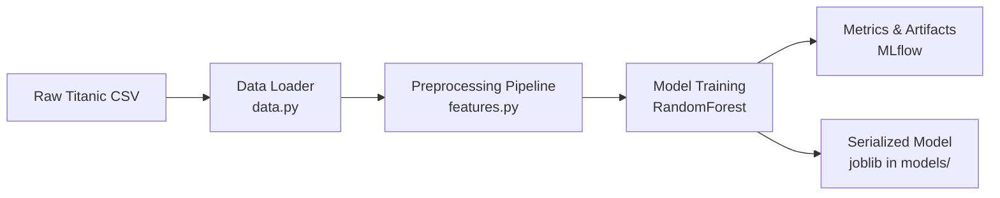
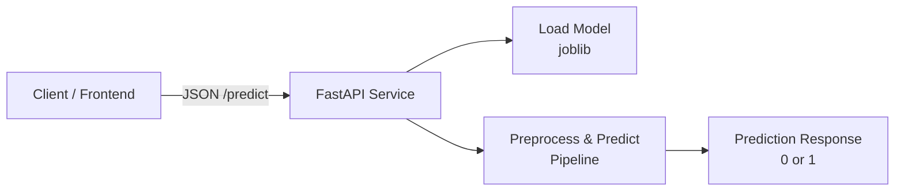
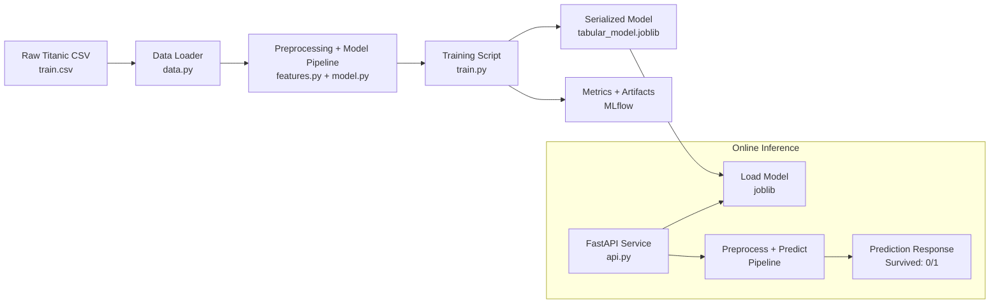
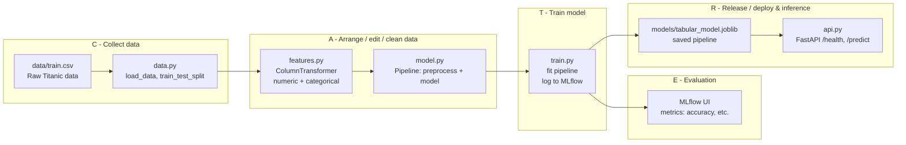
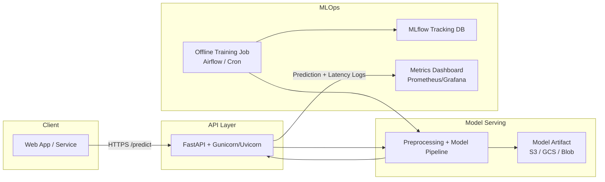

# Project 1 – Tabular ML with MLOps flavor

Goal: Build an end to end tabular ML pipeline on the **Titanic dataset** to predict passenger survival, using patterns that can be reused for other business problems such as credit risk scoring or housing price prediction.

This project covers:

- Data loading and exploratory data analysis (EDA)
- Feature engineering with scikit learn pipelines
- Model training and evaluation (binary classification)
- Experiment tracking with MLflow
- Serving the trained model via a FastAPI endpoint
- Basic tests for data and inference

## Dataset

- Source: Titanic `train.csv` (classic Kaggle dataset), stored at `data/train.csv`.
- Target: `Survived` (0 = did not survive, 1 = survived).
- Example feature columns:
  - Numeric: `Pclass`, `Age`, `SibSp`, `Parch`, `Fare`
  - Categorical: `Sex`, `Embarked`
- Additional columns like `Name`, `Ticket`, `Cabin` are currently unused but could be engineered into features later.

## CATER interview script (30 sec)

If I map this to my CATER framework:

- C(ollect) is Titanic survival dataset with local, open-source constraints.
- A(rrange) is the scikit learn pipeline architecture plus data/feature setup.
- T(rain) is the training script wrapped with MLflow tracking.
- E(valuate) is evaluation in MLflow UI with test metrics.
- R(elease) is releasing the joblib pipeline behind a FastAPI /predict endpoint.”

## CATER High Level Flow

C – collect data
I use data.py to load the Titanic CSV from data/train.csv and create the train/test split.

A – arrange / edit / clean data
In features.py I build a scikit-learn ColumnTransformer that imputes, scales numeric features and one-hot encodes categorical ones. model.py wraps that into a single preprocessing + model pipeline.

T – train model
train.py fits the pipeline on the training set, evaluates on the test set, and logs metrics and the model to MLflow.

E – evaluation
I review accuracy (and other metrics if needed) in the MLflow UI to compare runs and confirm the model’s performance is stable and reproducible.

R – release / deploy & inference
The trained pipeline is saved as models/tabular_model.joblib, and api.py loads it at startup to serve /health and /predict FastAPI endpoints for online inference.

## Architecture (CATER detail view)

### C – Collect, context & constraints

- Problem: binary classification – predict whether a passenger **survived** the Titanic (`Survived` column).
- Data: single tabular CSV at `data/train.csv`.
- Constraints:
  - Runs locally on a laptop (no paid cloud).
  - Uses only open source tools (pandas, scikit learn, MLflow, FastAPI).
  - Simple enough to demo, structured enough to extend to real business cases.

### A – Arrange & data/feature design

- `data.py`  
  - Loads the raw Titanic CSV.  
  - Performs a train/test split.
- `features.py`  
  - Infers numeric vs categorical columns from dtypes.  
  - Builds a `ColumnTransformer`:
    - Numeric: median imputation + `StandardScaler`.
    - Categorical: most-frequent imputation + `OneHotEncoder` (ignore unknowns).
- `model.py`  
  - Wraps the preprocessor and estimator into a single scikit learn `Pipeline`.  
  - Uses `RandomForestClassifier` as a robust, baseline model.

### T – Training & experiment tracking

- `train.py`
  - Calls `load_data()` and `train_test_split()` to get `X_train`, `X_test`, `y_train`, `y_test`.
  - Builds the pipeline via `build_pipeline(...)`.
  - Fits the model on the training data.
  - Evaluates on the test set (e.g., accuracy for this binary classification task).
- MLflow
  - `mlflow.set_experiment(...)` groups all runs for this project.
  - `mlflow.log_metric(...)` logs evaluation metrics.
  - `mlflow.sklearn.log_model(...)` logs the trained pipeline as an artifact.

### E – Evaluation & interpretation

- Metrics:
  - Primary: classification accuracy on the held-out test set (can extend to ROC AUC, precision/recall).
- MLflow UI:
  - Used to compare multiple runs (e.g., different model hyperparameters or feature sets).
  - Artifacts (model, env files) are inspected to ensure runs are reproducible.
- Future extensions:
  - Feature importance or permutation importance to explain which features drive survival.

### R – Release & runtime (serving the model)

- `models/tabular_model.joblib`
  - Serialized trained pipeline (preprocessing + model) saved by `train.py`.
- `api.py` (FastAPI service)
  - On startup: loads `tabular_model.joblib` once into memory.
  - `/health` endpoint: simple health check for monitoring.
  - `/predict` endpoint:
    - Accepts a JSON payload with a `features` dict (keys match training columns like `Pclass`, `Sex`, `Age`, `Fare`, etc.).
    - Wraps features into a one-row DataFrame and calls the pipeline’s `.predict(...)`.
    - Returns the predicted `Survived` value as the response.
- This design mirrors a production pattern:
  - Offline training + MLflow tracking.
  - Serialized model artifact.
  - Lightweight online inference service ready to be containerized and deployed behind a load balancer.

The goal is not to maximize Titanic leaderboard score, but to demonstrate a clean,
reusable pattern for tabular ML + MLOps that can be applied to other datasets and
business problems.

## How to run

From the repo root, activate your virtualenv, then:

```bash
cd 01_tabular-ml-mlops

# train and log to MLflow
python -m src.train

# start API
uvicorn src.api:app --reload

# after you send a request
curl -X POST "http://127.0.0.1:8000/predict" \
  -H "Content-Type: application/json" \
  -d '{"features": {"feature_1": 0.1, "feature_2": 3.14}}'
```

### Architect “checklist” for this project

As a solution architect, when you glance at this project, you want to be able to say:

1.. Data → Model → API is wired cleanly

- Data loader (data.py) uses a clear config path.
- Feature engineering is modular and testable (features.py).
- Model training is decoupled from serving (train.py vs api.py).
- Preprocessing is handled in a pipeline (features.py + model.py).
- Serving uses the exact same pipeline (no training/serving skew).

2.. Experiments are traceable

- MLflow logs every run with metrics and artifacts.
- You can compare experiments over time (e.g., baseline vs tuned model).

3.. It’s reproducible

- A new dev can:
- Clone repo
- pip install -r requirements.txt
- make train && make serve
- No hidden “magic” paths or manual steps.
  
4.. You can talk about tradeoffs

- Why a RandomForest as a baseline vs XGBoost/LightGBM.
- How you’d move MLflow from local filesystem → DB backend in prod.
- How you’d containerize this (later: Dockerfile) and deploy on AWS/Azure/GCP.

## Architecture Diagrams

### 1. Training pipeline diagram



### 2. Inference / serving diagram



### 3. Overall



### CATER



### 4. Extended “production-ish” version

They might say: “Now put this on a cloud with monitoring”:



### Three key talking points

1 - System design & structure

- Clear separation of concerns:
  - data.py → loading + splitting.
  - features.py → preprocessing pipeline (impute, scale, encode).
  - model.py → build pipeline + evaluate.
  - train.py → orchestration + MLflow logging.
  - api.py → FastAPI serving.
- Same scikit-learn Pipeline is used in training and inference → no train/serve skew.

2 - Data & modeling decisions

- Target: Survived (binary classification).
- Numeric vs categorical features automatically inferred from dtypes.
- RandomForest as a robust baseline:
  - Handles non-linearities and interactions.
  - Works well with mixed feature types.
  - Easy to swap later for XGBoost/LightGBM if needed.

3 - MLOps & lifecycle

- MLflow used for:
  - Tracking metrics per run (accuracy, etc.).
  - Storing model artifacts and environment info.
- Local filesystem backend for MLflow in the lab; in production you’d:
  - Move tracking to DB (e.g., sqlite:///mlflow.db or Postgres).
  - Store models and artifacts in object storage (S3/GCS/Azure Blob).
- Testable: small pytest tests for data loading and inference sanity.


### Detail of Preprocessing

Cool, let’s zoom in on the preprocessing piece in simple terms.

Think of preprocessing as getting the data into a shape the model can actually understand and keeping that process consistent for both training and prediction.

⸻

1. What the raw data looks like

A Titanic row looks like this:
	•	Pclass = 3
	•	Name = “John Smith”
	•	Sex = “male”
	•	Age = 22
	•	SibSp = 0
	•	Parch = 0
	•	Ticket = “A/5 21171”
	•	Fare = 7.25
	•	Cabin = NaN
	•	Embarked = “S”

The model can’t work directly with strings or missing values. That’s where preprocessing comes in.

⸻

2. Step 1 – Fill in missing values (imputation)

Real Titanic data has missing values:
	•	Age sometimes missing
	•	Cabin often missing
	•	Embarked missing in a few rows

In features.py we:
	•	For numeric columns (Age, Fare, etc.):
→ Fill missing values with the median of that column.
	•	For categorical columns (Sex, Embarked, etc.):
→ Fill missing values with the most frequent category.

Why?
	•	Models don’t like NaNs.
	•	Using median / most frequent is a simple, robust default that keeps us from dropping rows.

⸻

3. Step 2 – Turn categories into numbers (one-hot encoding)

The model can’t directly read "male" vs "female" or "S" vs "C" vs "Q".

We use OneHotEncoder to turn each category into its own 0/1 flag:
	•	Sex = "male" → Sex_male = 1, Sex_female = 0
	•	Sex = "female" → Sex_male = 0, Sex_female = 1

Same for Embarked:
	•	Embarked = "S" → Embarked_S = 1, Embarked_C = 0, Embarked_Q = 0, etc.

This gives the Random Forest clean numeric inputs like:

[Pclass, Age, Fare, Sex_male, Sex_female, Embarked_S, Embarked_C, Embarked_Q, …]

⸻

4. Step 3 – Scale numeric features (StandardScaler)

Some numeric columns are on very different scales:
	•	Age ~ 0–80
	•	Fare ~ 0–500+
	•	SibSp / Parch are small integers

We use StandardScaler on numeric columns:
	•	Subtract mean and divide by standard deviation
	•	So each numeric feature ends up roughly around 0 with scale ~1

Random Forests don’t require scaling as strongly as some models, but it’s still a nice standard habit and makes the feature space more balanced.

⸻

5. Step 4 – Keep all this logic in a single pipeline

In features.py + model.py:
	•	We use a ColumnTransformer to say:
	•	“These columns are numeric → impute + scale.”
	•	“Those columns are categorical → impute + one-hot encode.”
	•	Then we wrap that together with the Random Forest into a single Pipeline.

So the pipeline does:
	1.	Apply all preprocessing steps.
	2.	Feed the cleaned numeric array into the Random Forest.

This same pipeline is:
	•	Fitted in train.py
	•	Saved as models/tabular_model.joblib
	•	Loaded and reused in api.py for /predict

That guarantees the exact same preprocessing for training and for live predictions.

⸻

6. What would happen without preprocessing?

If we skipped preprocessing:
	•	Missing Age / Cabin → model errors or silently drops rows.
	•	Text columns like Sex, Embarked, Ticket → model can’t handle strings; you’d get type errors.
	•	If you tried to hand-roll manual encodings at training time and forgot to do the same at inference:
	•	Training and prediction would see different feature shapes → model breaks or gives garbage.

So the TL;DR explanation for an interviewer:

“I use a ColumnTransformer + Pipeline to standardize the data before modeling. It imputes missing values, scales numerics, one-hot encodes categoricals, and then passes that to the Random Forest. Because the preprocessing is baked into the pipeline and saved as a single object, the model sees exactly the same transformations at training and at prediction time.”


### Modeling Detail
Think of the Random Forest like a committee of decision trees voting on who survives.

Here’s the simple version, step by step.

⸻

1. What the model sees

For each passenger, the model doesn’t see “Jack” or “Rose” as characters; it sees a row of numbers and categories, like:
	•	Pclass = 3
	•	Sex = male
	•	Age = 22
	•	SibSp = 0 (siblings/spouses aboard)
	•	Parch = 0 (parents/children aboard)
	•	Fare = 7.25
	•	Embarked = S

Our preprocessing step (features.py + model.py) turns these into a numeric feature vector (e.g., one-hot encodes Sex and Embarked, scales some values, etc.).

⸻

2. One decision tree: “if-else” rules

A single decision tree learns rules from the historical data, like a flowchart:
	•	If Sex = female
→ and Pclass is 1 or 2
→ then likely Survived = 1
	•	Else if Sex = male
→ and Pclass = 3
→ and Age < 16
→ then maybe Survived = 1
→ else Survived = 0

The tree doesn’t know Titanic; it just looks at lots of examples and finds splits that best separate survivors (1) from non-survivors (0).

Each leaf in the tree ends up with something like:
	•	80 passengers reached this leaf
	•	60 survived, 20 did not → leaf predicts 1 (survive)
	•	Or 70 passengers reached another leaf
	•	10 survived, 60 did not → leaf predicts 0

So a single tree is:
“Walk down the if/else questions until you reach a leaf → use the majority label at that leaf (0 or 1).”

⸻

3. A forest = many trees, different perspectives

A Random Forest builds many trees (e.g., 100):
	•	Each tree sees a slightly different sample of passengers (bootstrapping).
	•	Each tree uses a slightly different subset of features when splitting.

So you might have:
	•	Tree 1: cares a lot about Sex, Pclass, Age.
	•	Tree 2: cares more about Fare, Embarked, Pclass.
	•	Tree 3: different rules again…

This randomness makes trees less similar to each other, so the forest is more robust and less likely to overfit than one big, deep tree.

⸻

4. How a prediction (0 or 1) is made

At prediction time, for a new passenger:
	1.	We preprocess the input row into features (same pipeline as training).
	2.	We send that feature vector into every tree in the forest.
	3.	Each tree independently predicts 0 or 1.
	4.	The forest takes a majority vote:
	•	If most trees say 1 → Survived, the forest outputs 1.
	•	If most say 0 → Did not survive, it outputs 0.

So for one passenger you might see:
	•	Tree predictions: [0, 0, 1, 0, 1, 0, 0, 1, …]
	•	Count zeros vs ones → if zeros win, prediction is 0.

That final 0 or 1 is what you see in the API response.

⸻

5. How this ties back to your project files
	•	features.py + model.py:
	•	Turn raw Titanic columns into a numeric vector.
	•	Build the RandomForestClassifier inside a Pipeline.
	•	train.py:
	•	Feeds many historical passengers (with known Survived labels) into the forest so it can learn its rules.
	•	api.py:
	•	Takes a new passenger, runs through the same preprocessing and forest, and returns the majority-vote 0 or 1.

