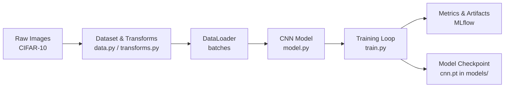
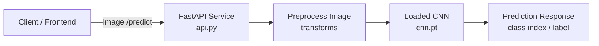
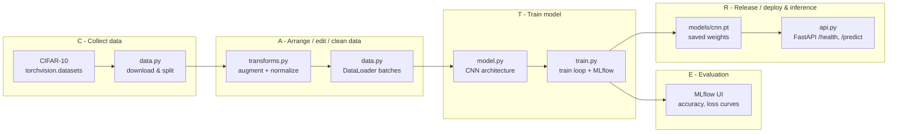
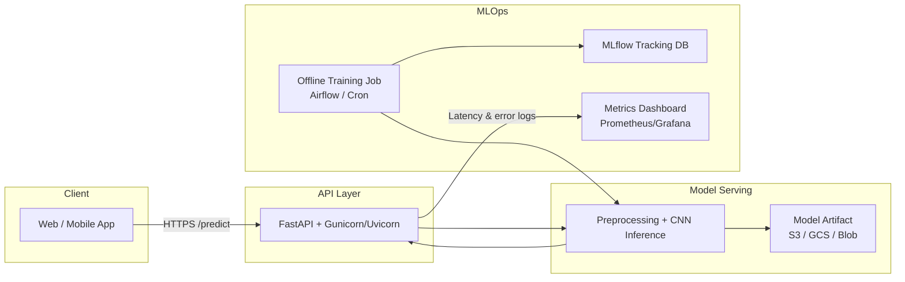

# Project 2 – Image classification with CNNs (CV + MLOps)

Goal: Build an end-to-end **image classification** pipeline on a standard vision dataset
(e.g., CIFAR-10), using a convolutional neural network (CNN), with experiment tracking
and an inference API. The pattern should generalize to real-world tasks like defect
detection, document classification, or product tagging.

This project covers:

- Data loading and train/validation splits for image datasets
- Data augmentation and normalization with `torchvision.transforms`
- CNN model definition and training loop in PyTorch
- Experiment tracking with MLflow (metrics, params, model artifacts)
- Serving the trained model via a FastAPI endpoint
- Basic tests / smoke checks for preprocessing and inference

---

## Dataset

- Default: **CIFAR-10** (10 classes, 32×32 color images).
  - Downloaded automatically via `torchvision.datasets.CIFAR10`.
- Target: multiclass label `0–9` corresponding to airplane, car, bird, cat, etc.
- Typical splits:
  - Train: 40k images
  - Val: 10k images
  - Test (optional): 10k images

---

## Quick Start

From this folder:

```bash
pip install -r requirements.txt

# train and log to MLflow
make train

# run tests
make test

# start API
make serve

# (optional) MLflow UI
make mlflow-ui
```

## Architect checklist

- Data → transforms → DataLoader → model → API are cleanly separated.
- Same preprocessing used in training and inference.
- MLflow tracks runs; best model exported to `models/cnn.pt`.
- FastAPI wraps model in `/predict` with a clear JSON contract (base64 image).

## CATER interview script (30 sec)

If I map this to my CATER framework:

- **C(ollect)** is the CIFAR-10 dataset, downloaded locally via `torchvision`, using only open-source tools and no paid cloud.
- **A(rrange)** is the preprocessing and augmentation pipeline: transforms for resize, normalize, and augment, plus PyTorch `DataLoader` for train/val.
- **T(rain)** is a CNN in PyTorch, trained in `train.py` with metrics and parameters logged to MLflow.
- **E(valuate)** is validation accuracy (and loss, per-epoch curves) tracked in MLflow so I can compare different architectures and hyperparameters.
- **R(elease)** is exporting the trained model weights and serving them behind a FastAPI `/predict` endpoint that takes an image and returns a predicted class.

---

## CATER high level flow

**C – collect data**  
- `data.py` uses `torchvision.datasets.CIFAR10` (or similar) to download the dataset
  and create train/val splits.

**A – arrange / edit / clean data**  
- `transforms.py` (or inside `data.py`) defines the preprocessing pipeline:
  - Convert to tensor, normalize channels.
  - Optionally apply data augmentation (random crop, flip, etc.).
- `data.py` wraps these in `DataLoader` objects for efficient batching.

**T – train model**  
- `model.py` defines a small CNN (e.g., conv → pool → conv → pool → FC).
- `train.py`:
  - Runs the training loop over epochs.
  - Logs training/validation loss and accuracy to MLflow.
  - Saves the best-performing model weights to `models/cnn.pt` (or similar).

**E – evaluation**  
- Validation metrics:
  - Top-1 accuracy, loss (per epoch).
  - Optionally confusion matrix or per-class accuracy.
- MLflow UI:
  - Used to compare architectures (e.g., different depth, dropout, learning rates).

**R – release / deploy & inference**  
- The trained CNN is saved as a PyTorch checkpoint in `models/cnn.pt`
  (or exported to TorchScript / ONNX if needed).
- `api.py`:
  - Loads the model on startup.
  - Applies the same preprocessing transforms to incoming images.
  - Exposes `/health` and `/predict` endpoints via FastAPI for online inference.

---

## Architecture (CATER detail view)

### C – Collect

- `data.py`:
  - Configures the dataset root directory.
  - Downloads CIFAR-10 if not present.
  - Splits train into train/val sets (e.g., 80/20) or uses the standard train/test split.

### A – Arrange (preprocessing & loaders)

- `transforms.py` (or inside `data.py`):
  - **Train transforms**:
    - RandomCrop / RandomHorizontalFlip (data augmentation).
    - `ToTensor()`.
    - Channel-wise normalization (mean/std for CIFAR-10).
  - **Val/Test transforms**:
    - CenterCrop/Resize (if needed).
    - `ToTensor()` and normalization only.

- `data.py`:
  - Wraps datasets with `DataLoader`:
    - Uses `batch_size`, `num_workers`, `shuffle=True` for train.

### T – Train (PyTorch + MLflow)

- `model.py`:
  - Defines `CnnClassifier(nn.Module)` with:
    - Convolution + pooling layers.
    - Flatten + fully-connected layers.
    - Softmax implied in loss function.

- `train.py`:
  - Sets up optimizer (e.g., Adam / SGD) and loss function (CrossEntropyLoss).
  - Runs an epoch loop:
    - Forward → loss → backward → optimizer step for train.
    - Computes val loss/accuracy each epoch.
  - MLflow:
    - `mlflow.set_experiment("cv-image-classification")`.
    - Logs loss/accuracy per epoch.
    - Logs model (state dict or full model) as an artifact.

### E – Evaluation

- Core metrics:
  - **Top-1 accuracy** on validation set.
  - **Loss curves** over epochs.
- Extended:
  - **Per-class accuracy** to see which classes are hardest.
  - Optional confusion matrix plot as an artifact (PNG) in MLflow.
- MLflow UI:
  - Compare runs across:
    - Different learning rates.
    - CNN depth/width.
    - Data augmentation configurations.

### R – Release & runtime (serving the model)

- `models/cnn.pt`:
  - Best model checkpoint (e.g., by highest val accuracy).

- `api.py`:
  - On startup:
    - Loads `cnn.pt` and sets `model.eval()`.
    - Initializes the same preprocessing transforms used during training.
  - `/health`:
    - Simple check returning `{"status": "ok"}`.
  - `/predict`:
    - Accepts an image (e.g., base64 or multipart upload).
    - Applies transforms (`ToTensor`, normalization).
    - Runs a forward pass through the CNN (no gradients).
    - Returns class index and/or class name.

- Ready for:
  - Containerization with Docker.
  - Deployment behind a load balancer on AWS/Azure/GCP.

---

## Metrics to watch (CV classification)

For a 10-class image classification task like CIFAR-10:

### Core metrics

- **Top-1 accuracy**
  - Random guess: 10%.
  - Simple CNN baseline:
    - **40–60%** → basic but working.
    - **60–80%** → solid for a small, hand-built model.
  - Very high accuracy (e.g., >90%) usually requires deeper nets or transfer learning.

- **Loss (CrossEntropy)**
  - Should **decrease over epochs** on the training set.
  - Val loss:
    - Should decrease or at least plateau.
    - If it starts increasing while train loss keeps dropping → overfitting.

- (Optional) **Per-class accuracy**
  - Useful to see if the model is biased toward certain classes
    (e.g., much better at cars than birds).

---

## Architecture diagrams

### 1. Training pipeline diagram



### 2. Inference / serving diagram



### 3. CATER diagram (CV version)



### 4. Extended “production-ish” version



### Example Request

```

curl -X POST "http://127.0.0.1:8000/predict" \
  -H "Content-Type: application/json" \
  -d '{"image_base64": "<base64-encoded-image-here>"}'
```

### Three key talking points (interview)

1 - System design & structure

- Clean separation between data loading (data.py), transforms (transforms.py),
model (model.py), training orchestration (train.py), and serving (api.py).
- Same preprocessing pipeline used for both training and inference.
  
2 - Modeling decisions

- CNN chosen because images have spatial structure; convolutions exploit locality and translation invariance.
- Data augmentation helps reduce overfitting on a relatively small dataset like CIFAR-10.
  
3 - MLOps & lifecycle

- MLflow tracks experiments (hyperparameters, architectures, metrics).
- Best model checkpoint saved and served via FastAPI.
- Design is ready to scale: can be containerized, put behind a load balancer,
and extended with monitoring and automated retraining.

## How the CNN makes predictions (simple explanation)

At a high level, the CNN is learning **patterns in pixels** to decide which class
(animal / object) an image belongs to.

### 1. What the model sees

Each CIFAR-10 image is:

- Size: **32 × 32 pixels**
- Channels: **3** (Red, Green, Blue)

So the model sees each image as a 3×32×32 grid of numbers (pixel intensities),
not as “a cat” or “a dog”.

We normalize these numbers using the same mean/std for all images so they are on
a consistent scale.

---

### 2. Convolution layers – pattern detectors

The first part of the network (`self.features` in `model.py`) is a stack of
**convolution + ReLU + pooling** layers.

You can think of each convolutional filter as a small **pattern detector**:

- Early layers:
  - Detect simple patterns like **edges**, **corners**, simple textures.
- Deeper layers:
  - Combine those into more complex patterns like **eyes**, **fur texture**,
    **wheels**, **wings**, etc.

Each convolution layer:

1. Slides small filters (e.g., 3×3) over the image.
2. Produces **feature maps** that highlight where certain patterns are present.
3. Passes the result through a non-linearity (`ReLU`) to keep only “activated”
   responses.

Pooling (MaxPool):

- Downsamples the feature maps (e.g., from 32×32 → 16×16 → 8×8).
- Keeps the most important activations.
- Makes the network less sensitive to small shifts and noise.

---

### 3. Fully connected layers – classifier

After the convolution/pooling stack, we:

- **Flatten** the final feature maps (e.g., 64 × 8 × 8 → a long vector).
- Feed that vector into a couple of **fully connected layers** (`self.classifier`).

These layers act like a traditional classifier:

- They look at all the extracted features.
- They learn combinations that are indicative of each class
  (e.g., “fur + four legs + certain textures” → dog).

The last linear layer outputs **10 numbers**, one per class (logits).

---

### 4. From logits to probabilities and a class label

During training:

- We feed the logits into **CrossEntropyLoss**, which:
  - Applies a softmax internally to turn logits into probabilities.
  - Compares them against the true label.
  - Computes the loss and backpropagates to update weights.

During inference in the API:

1. We compute logits with `model(tensor)`.
2. We apply `softmax` to convert them into probabilities.
3. We take the **argmax** (index of the largest probability):
   - That index is the **predicted class**.
   - We map the index to a human-readable label using `config.class_names`.
   - The highest probability is returned as the **confidence**.

Example API response:

```json
{
  "class_index": 5,
  "class_name": "dog",
  "confidence": 0.45
}
```

### Why a CNN for this problem?

Compared to a fully connected network on raw pixels, a CNN:

- Respects image structure (nearby pixels are related).
- Learns local patterns that are reused across the whole image.
- Is more parameter-efficient and usually performs much better on vision tasks.

In short, the CNN learns a hierarchy of visual features (edges → textures → parts → objects)
and then uses those features to classify each image into one of the 10 CIFAR-10 classes.

## Mini “metrics to watch” section for CV

```markdown
## Metrics to watch

- Top-1 accuracy on validation set
  - Random guess ~10%
  - 40–60%: basic but working baseline
  - 60–80%: solid for a small custom CNN trained a few epochs
- Loss (CrossEntropy)
  - Should decrease on train; val loss stabilizing or slowly improving.
  - Train ↓ but val ↑ → overfitting.
```


## Interview Questions

Q1. Why did you choose a CNN instead of a fully connected network?

“Images have local structure: nearby pixels are strongly related. CNNs exploit that with small filters that detect local patterns like edges and textures, and reuse them across the whole image. This gives better performance and far fewer parameters than a fully connected network on all 32×32×3 pixels.”

⸻

Q2. How do you prevent overfitting here?

Short answer:

“I use data augmentation (random crop, horizontal flip), early stopping via monitoring validation accuracy/loss, and I keep the CNN relatively small. If I needed more regularization, I’d add dropout in the classifier and weight decay in the optimizer.”

⸻

Q3. What metrics do you care about?

“Top-1 validation accuracy and loss. Random guess on CIFAR-10 is 10%. With this small CNN I get around 60–70% after a few epochs, which is a reasonable baseline. I also watch the train vs val loss curves in MLflow: if train keeps dropping but val starts rising, that’s a sign of overfitting.”

⸻

Q4. How do you make sure preprocessing at inference matches training?

“The normalization and transforms are defined in transforms.py and reused both in the DataLoader and in the FastAPI service. At inference I apply the exact same ToTensor+Normalize pipeline before sending the tensor into the model, which avoids train–serve skew.”

⸻

Q5. How would you productionize this beyond a single FastAPI process?

“I’d package the model and API into a Docker image, run it behind a load balancer (ALB / Nginx / API Gateway), and externalize the model artifact to object storage. I’d add monitoring for latency and error rate, and keep MLflow or a similar system as the source of truth for which model version is deployed.”