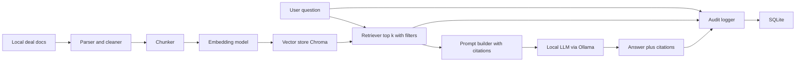

# Deal room copilot local MVP

A local-first Retrieval Augmented Generation RAG copilot for investment banking deal rooms. It indexes a deal’s documents and answers questions with citations, audit logs, and strict “not found” behavior. Runs fully offline on a laptop.

## What this MVP does

- Ingests deal documents from a local folder
- Chunks and embeds text into a local vector store
- Answers questions using a local LLM (genai) with retrieved context
- Returns citations with file name and page when available
- Logs every query and retrieval trace to a local SQLite database
- Enforces deal scoped access via deal_id filters

## Why local first

- Privacy by default for sensitive deal materials
- Zero usage cost
- Fast iteration for prototyping and interviews
- Same architecture can swap to Azure OpenAI and Azure AI Search later

## Tech stack

- LLM local with Ollama
- Embeddings local with sentence transformers
- Vector store local with Chroma or FAISS
- Parsing with PyMuPDF for PDFs and python-docx for Word docs
- API with FastAPI
- UI with Streamlit
- Audit logging with SQLite

## Repo structure

```text
deal-room-copilot/
  README.md
  data/
    deals/
      <deal_id>/
        raw/
        processed/
  apps/
    api/
      main.py
      routes/
      services/
    ui/
      app.py
  rag/
    ingest.py
    chunking.py
    embeddings.py
    retrieval.py
    prompts.py
    citations.py
  storage/
    vectorstore.py
    audit_db.py
  configs/
    settings.py
  scripts/
    ingest_deal.sh
    run_api.sh
    run_ui.sh
  tests/
    test_retrieval.py
    test_citations.py
  requirements.txt
```

## NLP components and skills demonstrated

This is an NLP system even though it is “RAG-first” and does not require training a custom model.

What’s NLP here
- **Document text extraction and preprocessing**: cleaning headers and footers, normalizing whitespace, preserving section structure for better downstream understanding
- **Tokenization-aware chunking**: splitting long documents into semantically coherent chunks with overlap so meaning is retained across boundaries
- **Embeddings**: converting text into vector representations for semantic similarity search
- **Information retrieval**: top-k retrieval, optional hybrid search (keyword + vector), optional reranking for precision
- **Natural language generation**: LLM produces a user-facing answer in natural language based on retrieved context
- **Grounded generation and factuality controls**: citations, abstention (“not found”), and evidence-first prompting to reduce hallucinations
- **NLP evaluation**: retrieval metrics (recall@k, MRR) and generation metrics (citation correctness, groundedness, abstention quality)

Optional traditional NLP add-ons (finance-friendly)
- **PII / MNPI detection and redaction** before indexing or prompting
- **NER** to extract entities (companies, tickers, people, dates) for better filtering and summaries
- **Structured extraction** (tables, key financial metrics) to support numeric Q&A and memo drafting


